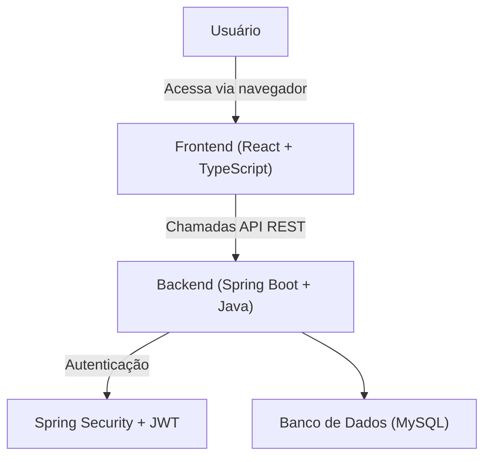

# TaskFlow

*Este projeto foi desenvolvido como parte do desafio final da Academia Java + GenAI da Accenture.*


## 🎯 Sobre o Projeto

O TaskFlow nasceu para combater a ineficiência e o ruído de comunicação causados por ferramentas de gestão de projetos excessivamente complexas. Em vez de forçar os usuários a "trabalhar para a ferramenta", o TaskFlow oferece uma plataforma **simples, transparente e confiável**, onde o status real do projeto é a única fonte da verdade.

O objetivo é empoderar as equipes com uma experiência de usuário limpa e de baixo atrito, restaurando a confiança nos dados e permitindo que todos se concentrem no que realmente importa: **executar tarefas e entregar valor.**

## 🤖 Metodologia BMAD

O desenvolvimento deste projeto é guiado pelo **BMAD (Brownfield & Modular Application Development)**, um método que utiliza uma abordagem estruturada e orientada por agentes de IA para gerenciar todo o ciclo de vida do software, desde a concepção e documentação até o desenvolvimento e os testes. Toda a documentação na pasta `/docs` foi gerada e é mantida seguindo os princípios desta metodologia.

## 🏛️ Arquitetura

A arquitetura do TaskFlow foi projetada para ser robusta, escalável e simples de manter, seguindo padrões de mercado modernos.

*   **Backend (Monólito Modular):** Construído com **Java e Spring Boot**, o backend é um sistema único, porém organizado em módulos de negócio bem definidos e desacoplados. Isso facilita a manutenção e a evolução do sistema.
*   **Frontend (Single Page Application):** Desenvolvido com **React e TypeScript**, o frontend é uma SPA reativa e componentizada, proporcionando uma experiência de usuário fluida e moderna.
*   **Comunicação:** A integração entre o frontend e o backend é feita através de uma **API RESTful** bem definida, com a segurança gerenciada por **Spring Security e tokens JWT**.



## 🚀 Stack de Tecnologias

| Categoria          | Tecnologia / Biblioteca     |
| ------------------ | --------------------------- |
| **Backend**        | Java (JDK 21), Spring Boot  |
| **Frontend**       | React, TypeScript, Vite     |
| **Banco de Dados** | MySQL 8.x (Local)           |
| **Autenticação**   | Spring Security, JWT        |
| **Estilização**    | Tailwind CSS                |
| **Comunicação API**| Axios (Frontend)            |
| **Build & Deps**   | Maven (Backend), NPM (Frontend) |
| **Documentação API**| Springdoc-OpenAPI (Swagger) |

## ✨ Funcionalidades Principais

*   **Autenticação Segura:** Sistema de login baseado em JWT.
*   **Gerenciamento de Projetos:** Criação e organização de projetos.
*   **Gestão de Tarefas:** Atribuição, acompanhamento e histórico de atividades.
*   **Dashboard Intituivo:** Painel com a visão geral do progresso.
*   **Administração de Usuários:** Gerenciamento de permissões e acessos.

## 🏁 Como Começar

Siga os passos abaixo para configurar e executar o projeto em seu ambiente local.

### Pré-requisitos

*   Java Development Kit (JDK 21+)
*   Apache Maven
*   Node.js e NPM
*   MySQL 8.x

### Backend

```bash
# Navegue até a pasta do backend
cd taskflow-backend

# Instale as dependências
mvn clean install

# Execute a aplicação
mvn spring-boot:run
```

### Frontend

```bash
# Navegue até a pasta do frontend
cd taskflow-frontend

# Instale as dependências
npm install

# Inicie o servidor de desenvolvimento
npm run dev
```

## 🧑‍💻 Contribuidores

Agradecemos a todas as pessoas que contribuíram para este projeto.

- [Cauany Rodrigues](https://github.com/CauanyRodrigues01)
- [Kevin Kennedy](https://github.com/kevinkennedy00)
- [Vinicius Leal](https://github.com/vinileal12)
- [João Vitor Pereira](https://github.com/vitorjoao210)