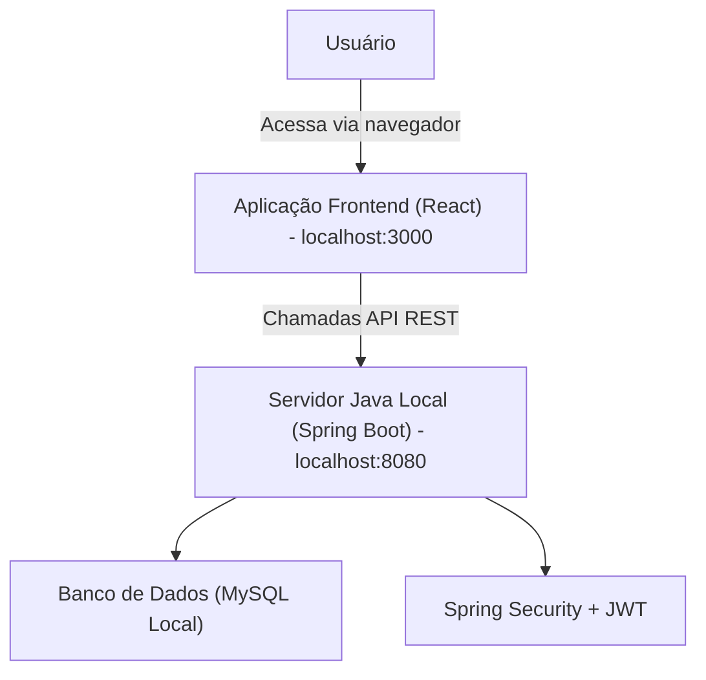
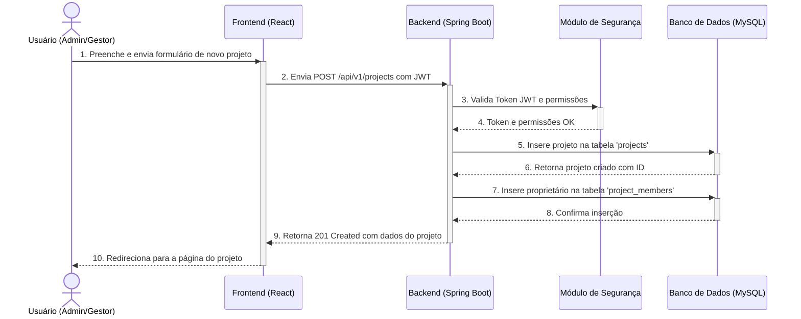

# TaskFlow Fullstack Architecture Document

## 1. Introduction

This document outlines the complete fullstack architecture for TaskFlow, including backend systems, frontend implementation, and their integration. It serves as the single source of truth for AI-driven development, ensuring consistency across the entire technology stack.

This unified approach combines what would traditionally be separate backend and frontend architecture documents, streamlining the development process for modern fullstack applications where these concerns are increasingly intertwined.

### 1.1. Change Log

| Date       | Version | Description                                | Author            |
| :--------- | :------ | :----------------------------------------- | :---------------- |
| 2025-11-05 | 1.0     | Initial draft of Fullstack Architecture Document | Winston (Architect) |

## 2. High-Level Architecture

### 2.1. Technical Summary

A arquitetura do TaskFlow será baseada em um **monólito modular (Spring Boot)** para o backend e uma **Single Page Application (SPA) com React** para o frontend. O foco principal é a implementação e apresentação da solução em um ambiente de desenvolvimento local. A integração entre frontend e backend ocorrerá via **APIs RESTful** bem definidas. O backend será executado em um servidor Java local (Spring Boot) e utilizará **MySQL local** como banco de dados. A autenticação será gerenciada internamente com **Spring Security e JWT**. Esta abordagem visa oferecer solidez e simplicidade para o desenvolvimento e demonstração do TaskFlow.

### 2.2. High-Level Architecture Diagram



### 2.3. Architectural Patterns

*   **Arquitetura Geral - Monólito Modular (Spring Boot):**
    *   **Descrição:** Uma aplicação backend única, mas estruturada internamente em módulos bem definidos e desacoplados, utilizando Spring Boot.
    *   **Justificativa:** Oferece simplicidade de desenvolvimento e implantação para o escopo atual do projeto, mantendo a capacidade de organizar o código de forma limpa e escalável internamente.

*   **Padrão de Frontend - UI Baseada em Componentes (React e TypeScript):**
    *   **Descrição:** Construção de interfaces de usuário a partir de componentes isolados, reutilizáveis e com estado próprio, usando React e TypeScript para tipagem forte.
    *   **Justificativa:** Facilita a manutenção, a reutilização de código e a testabilidade das interfaces, além de garantir maior robustez com o uso de tipos.

*   **Padrão de Backend - API RESTful:**
    *   **Descrição:** Comunicação entre frontend e backend através de uma interface de programação de aplicações (API) que segue os princípios REST (Representational State Transfer).
    *   **Justificativa:** Padroniza a comunicação, é amplamente suportada e compreendida, e facilita a integração entre diferentes partes do sistema.

## 3. Definição da Tech Stack

| Categoria              | Tecnologia / Biblioteca         | Justificativa                                                                                             |
| :--------------------- | :------------------------------ | :-------------------------------------------------------------------------------------------------------- |
| **Backend**            | Java (JDK 21), Spring Boot 3.x  | Ecossistema robusto, maduro e amplamente adotado para construir APIs RESTful seguras e performáticas.      |
| **Frontend**           | React, TypeScript, Vite         | React para componentização de UI, TypeScript para segurança de tipos e Vite para um ambiente de dev rápido. |
| **Banco de Dados**     | MySQL 8.x (Local)               | Banco de dados relacional popular, confiável e bem suportado pelo ecossistema Java/Spring.                |
| **Autenticação**       | Spring Security, JWT            | Padrão de mercado para segurança em aplicações Spring, oferecendo controle robusto de acesso.             |
| **Estilização (Frontend)** | Tailwind CSS                  | Framework CSS utility-first que permite a construção rápida de interfaces customizadas sem escrever CSS.  |
| **Comunicação API**    | Axios (Frontend)                | Cliente HTTP popular para realizar requisições do frontend para o backend de forma simples e padronizada. |
| **Build & Dependências** | Maven (Backend), NPM (Frontend) | Gerenciadores de dependências e build padrão para seus respectivos ecossistemas.                          |
| **Documentação API**   | Springdoc-OpenAPI (Swagger)     | Geração automática de documentação interativa da API, facilitando a colaboração e os testes.            |

## 4. Estrutura Unificada do Projeto (Polyrepo)

A estrutura do projeto adota uma abordagem Polyrepo dentro de um único repositório Git, com diretórios distintos para `taskflow-backend`, `taskflow-frontend` e um diretório `shared` para tipos TypeScript, garantindo separação de responsabilidades e compartilhamento de código.

```
TaskFlow/
├── taskflow-backend/           # Aplicação Backend (Java/Spring Boot)
│   ├── src/main/java/com/taskflow/
│   │   ├── project/            # Módulo de funcionalidade para Projetos
│   │   ├── task/               # Módulo de funcionalidade para Tarefas
│   │   ├── user/               # Módulo de funcionalidade para Usuários
│   │   ├── security/           # Componentes de segurança transversais
│   │   └── ...
│   ├── pom.xml
│   └── .env.example
├── taskflow-frontend/          # Aplicação Frontend (React/TypeScript)
│   ├── src/
│   │   ├── components/         # Componentes UI reutilizáveis
│   │   ├── features/           # Módulos de funcionalidade (auth, projects, tasks)
│   │   ├── services/           # Clientes de API
│   │   └── ...
│   ├── package.json
│   └── .env.local.example
├── shared/                     # Pacote de tipos compartilhados (TypeScript)
│   ├── src/
│   │   └── types/              # Interfaces TypeScript (User, Project, Task, etc.)
│   └── package.json
└── docs/
    └── architecture.md         # Este documento
```

## 5. Modelagem de Dados

### 5.1. Modelo Conceitual e Papéis

A lógica de permissões do sistema é baseada em três papéis de usuário distintos, que definem o que cada um pode fazer.

*   **Entidades Principais:**
    *   **User:** Representa um usuário do sistema.
    *   **Project:** Contêiner para tarefas. Cada projeto tem um `owner` e múltiplos `members`.
    *   **ProjectMember:** Tabela de associação que liga `Users` a `Projects`.
    *   **Task:** A unidade de trabalho, pertencente a um `Project`.
    *   **Comment:** Comentários feitos em uma `Task`.

*   **Definição Detalhada dos Papéis:**

    #### 1. `ADMIN` (Administrador)
    *   **Função:** Superusuário com acesso total e irrestrito ao sistema.
    *   **Permissões:**
        *   Realizar **todas as ações** de um `PROJECT_MANAGER` em **qualquer projeto**.
        *   Acesso a todos os endpoints da API, sem exceção.
        *   Capacidade implícita de gerenciar todos os dados do sistema.

    #### 2. `PROJECT_MANAGER` (Gerente de Projeto)
    *   **Função:** Criar e gerenciar os projetos dos quais é proprietário.
    *   **Permissões:**
        *   **Projetos:**
            *   Pode **criar** novos projetos.
            *   Para os projetos que gerencia (`owner`), pode **visualizar**, **atualizar** e **deletar**.
        *   **Membros:**
            *   Pode **adicionar** e **remover** membros (`COLLABORATOR`) de seus projetos.
        *   **Tarefas:**
            *   Pode **criar**, **visualizar**, **atualizar**, **deletar** e **atribuir** tarefas dentro de seus projetos.
        *   **Comentários:**
            *   Pode **adicionar** comentários.

    #### 3. `COLLABORATOR` (Colaborador)
    *   **Função:** Membro de um projeto com acesso limitado, focado em visualização e comunicação.
    *   **Permissões:**
        *   **Projetos:**
            *   Pode **visualizar** os projetos dos quais é membro.
            *   **NÃO PODE** criar, atualizar ou deletar projetos.
        *   **Membros:**
            *   **NÃO PODE** gerenciar membros.
        *   **Tarefas:**
            *   Pode **visualizar** as tarefas dos projetos dos quais é membro.
            *   **NÃO PODE** criar, editar, deletar ou atribuir tarefas.
        *   **Comentários:**
            *   Pode **adicionar** comentários às tarefas.

### 5.2. Esquema do Banco de Dados (MySQL DDL)

Este script SQL define a estrutura completa do banco de dados.

```sql
CREATE DATABASE IF NOT EXISTS taskflow_db;
USE taskflow_db;

CREATE TABLE users (
    id BIGINT AUTO_INCREMENT PRIMARY KEY,
    name VARCHAR(255) NOT NULL,
    email VARCHAR(255) NOT NULL UNIQUE,
    password_hash VARCHAR(255) NOT NULL,
    role VARCHAR(50) NOT NULL,
    created_at DATETIME DEFAULT CURRENT_TIMESTAMP
);

CREATE TABLE projects (
    id BIGINT AUTO_INCREMENT PRIMARY KEY,
    name VARCHAR(255) NOT NULL,
    description TEXT,
    owner_id BIGINT NOT NULL,
    created_at DATETIME DEFAULT CURRENT_TIMESTAMP,
    FOREIGN KEY (owner_id) REFERENCES users(id) ON DELETE CASCADE
);

CREATE TABLE project_members (
    project_id BIGINT NOT NULL,
    user_id BIGINT NOT NULL,
    PRIMARY KEY (project_id, user_id),
    FOREIGN KEY (project_id) REFERENCES projects(id) ON DELETE CASCADE,
    FOREIGN KEY (user_id) REFERENCES users(id) ON DELETE CASCADE
);

CREATE TABLE tasks (
    id BIGINT AUTO_INCREMENT PRIMARY KEY,
    title VARCHAR(255) NOT NULL,
    description TEXT,
    status VARCHAR(50) NOT NULL DEFAULT 'TODO',
    priority VARCHAR(50) NOT NULL DEFAULT 'MEDIUM',
    due_date DATETIME,
    project_id BIGINT NOT NULL,
    assignee_id BIGINT,
    created_at DATETIME DEFAULT CURRENT_TIMESTAMP,
    updated_at DATETIME DEFAULT CURRENT_TIMESTAMP ON UPDATE CURRENT_TIMESTAMP,
    FOREIGN KEY (project_id) REFERENCES projects(id) ON DELETE CASCADE,
    FOREIGN KEY (assignee_id) REFERENCES users(id) ON DELETE SET NULL
);

CREATE TABLE comments (
    id BIGINT AUTO_INCREMENT PRIMARY KEY,
    content TEXT NOT NULL,
    task_id BIGINT NOT NULL,
    author_id BIGINT NOT NULL,
    created_at DATETIME DEFAULT CURRENT_TIMESTAMP,
    FOREIGN KEY (task_id) REFERENCES tasks(id) ON DELETE CASCADE,
    FOREIGN KEY (author_id) REFERENCES users(id) ON DELETE CASCADE
);
```

## 6. Arquitetura do Backend (Monólito Modular)

A aplicação backend é um monólito, mas internamente organizada em módulos de negócio coesos e independentes, seguindo a abordagem **"package-by-feature"**.

### 6.1. Organização de Pacotes

```
com/taskflow/
├── project/            # Módulo de funcionalidade para Projetos
│   ├── ProjectController.java
│   ├── ProjectService.java
│   ├── ProjectRepository.java
│   ├── Project.java
│   └── dto/
├── task/               # Módulo de funcionalidade para Tarefas
│   └── ...
├── user/               # Módulo de funcionalidade para Usuários
│   └── ...
├── security/           # Componentes de segurança transversais
└── exception/          # Handlers de exceção globais
```

### 6.2. Camada de Acesso a Dados

*   **Tecnologia:** Spring Data JPA.
*   **Padrão:** O Repository Pattern é implementado via interfaces que estendem `JpaRepository`, abstraindo o acesso a dados e fornecendo métodos CRUD.
*   **Transações:** Gerenciadas pelo Spring com a anotação `@Transactional` na camada de `Service`, garantindo a atomicidade das operações.

### 6.3. Autenticação e Autorização

*   **Tecnologia:** Spring Security e JSON Web Tokens (JWT).
*   **Fluxo:** Um filtro customizado (`JwtAuthenticationFilter`) intercepta as requisições, valida o token JWT e configura o `SecurityContextHolder` do Spring. A autorização em nível de método é aplicada nos controllers usando a anotação `@PreAuthorize`.

## 7. Arquitetura do Frontend (SPA)

### 7.1. Organização de Pastas

A estrutura de pastas é organizada por funcionalidade para promover a coesão e a escalabilidade.

```
src/
├── components/         # Componentes de UI globais e reutilizáveis (Button, Input)
├── features/           # Módulos de funcionalidade (features)
│   ├── auth/           # Funcionalidade de autenticação
│   ├── projects/       # Funcionalidade de projetos
│   └── tasks/          # Funcionalidade de tarefas
├── services/           # Lógica de comunicação com a API
├── contexts/           # Contextos React para estado global
├── hooks/              # Hooks customizados
├── pages/              # Componentes que representam as páginas/rotas
└── ...
```

### 7.2. Gerenciamento de Estado

*   **Estado Global:** React Context API para dados de autenticação do usuário (`AuthContext`).
*   **Estado do Servidor:** Hooks customizados (ex: `useProjects`, `useTasks`) que encapsulam a lógica de fetch, cache, loading e erros, mantendo os componentes de UI limpos.

### 7.3. Roteamento

*   **Biblioteca:** React Router.
*   **Rotas Protegidas:** Um componente `ProtectedRoute` verifica o estado de autenticação no `AuthContext` e redireciona para a página de login se o usuário não estiver autenticado.

## 8. Especificação da API RESTful

**URL Base:** `/api/v1`
**Autenticação:** Todas as rotas, exceto `/auth/**`, exigem um `Bearer Token` JWT.

### 8.1. Autenticação (`/auth`)

*   `POST /auth/register`: Registra um novo usuário.
*   `POST /auth/login`: Autentica um usuário e retorna um token JWT.

### 8.2. Projetos (`/projects`)

*   `POST /projects`: Cria um novo projeto (Permissão: `ADMIN`, `PROJECT_MANAGER`).
*   `GET /projects`: Lista projetos com base no papel do usuário.
*   `GET /projects/{projectId}`: Obtém detalhes de um projeto.
*   `PUT /projects/{projectId}`: Atualiza um projeto (Permissão: `ADMIN`, `PROJECT_MANAGER` proprietário).
*   `DELETE /projects/{projectId}`: Deleta um projeto (Permissão: `ADMIN`, `PROJECT_MANAGER` proprietário).

### 8.3. Membros do Projeto (`/projects/{projectId}/members`)

*   `POST /projects/{projectId}/members`: Adiciona um usuário a um projeto (Permissão: `ADMIN`, `PROJECT_MANAGER` proprietário).
*   `DELETE /projects/{projectId}/members/{userId}`: Remove um membro de um projeto (Permissão: `ADMIN`, `PROJECT_MANAGER` proprietário).

### 8.4. Tarefas (`/projects/{projectId}/tasks`)

*   `POST /projects/{projectId}/tasks`: Cria uma nova tarefa (Permissão: `ADMIN`, `PROJECT_MANAGER`).
*   `GET /projects/{projectId}/tasks`: Lista todas as tarefas de um projeto.
*   `PUT /projects/{projectId}/tasks/{taskId}`: Atualiza uma tarefa (Permissão: `ADMIN`, `PROJECT_MANAGER`).
*   `PATCH /projects/{projectId}/tasks/{taskId}`: Atualiza parcialmente uma tarefa (Permissão: `ADMIN`, `PROJECT_MANAGER`).
*   `DELETE /projects/{projectId}/tasks/{taskId}`: Deleta uma tarefa (Permissão: `ADMIN`, `PROJECT_MANAGER`).

### 8.5. Comentários (`/tasks/{taskId}/comments`)

*   `POST /tasks/{taskId}/comments`: Adiciona um novo comentário a uma tarefa (Permissão: Membros do projeto).

## 9. Fluxos de Trabalho Principais

### 9.1. Fluxo de Criação de Projeto

Este diagrama ilustra a criação de um novo projeto por um usuário autorizado.



## 10. Fluxo de Desenvolvimento Local

### 10.1. Pré-requisitos

*   JDK 21
*   Maven 3.x
*   Node.js (LTS) e NPM
*   MySQL Server 8.x
*   Git

### 10.2. Configuração Inicial

1.  **Clonar o repositório.**
2.  **Configurar Backend:** Navegue para `taskflow-backend`, copie `.env.example` para `.env` e configure as variáveis do banco de dados. Rode `mvn clean install`.
3.  **Configurar Frontend:** Navegue para `taskflow-frontend`, copie `.env.local.example` para `.env.local`. Rode `npm install`.
4.  **Configurar Shared:** Navegue para `shared` e rode `npm install`.

### 10.3. Comandos de Desenvolvimento

*   **Iniciar Backend:** Em `taskflow-backend`, rode `mvn spring-boot:run`.
*   **Iniciar Frontend:** Em `taskflow-frontend`, rode `npm start`.

## 11. Estratégia de Testes

Para garantir a qualidade e a estabilidade da aplicação, adotaremos uma abordagem de testes em múltiplas camadas.

### 11.1. Testes de Backend

*   **Testes Unitários:**
    *   **Frameworks:** JUnit 5 e Mockito.
    *   **Escopo:** Isolar e testar a lógica de negócio em classes de `Service`. As dependências (como `Repositories`) serão mockadas para garantir que apenas a unidade de código em questão seja testada.
*   **Testes de Integração:**
    *   **Framework:** Spring Boot Test com `@SpringBootTest`.
    *   **Escopo:** Testar a interação entre as camadas da aplicação, desde o `Controller` até o banco de dados. Utilizaremos um banco de dados em memória (como H2) ou uma instância de teste do MySQL para validar os fluxos completos da API.

### 11.2. Testes de Frontend

*   **Testes de Componentes:**
    *   **Frameworks:** Jest e React Testing Library.
    *   **Escopo:** Testar componentes de UI de forma isolada para garantir que eles renderizem corretamente e respondam às interações do usuário conforme o esperado.
*   **Testes de Integração:**
    *   **Escopo:** Testar a interação entre múltiplos componentes, como a submissão de um formulário que chama um serviço de API mockado e atualiza o estado da aplicação.

### 11.3. Testes End-to-End (E2E)

*   **Framework (Sugestão Futura):** Cypress ou Playwright.
*   **Escopo:** Embora não seja o foco para a implementação inicial, em uma fase futura, os testes E2E seriam implementados para simular jornadas completas do usuário no navegador, garantindo que o frontend e o backend funcionem juntos corretamente.

## 12. Considerações de Segurança

Além da autenticação e autorização já definidas, as seguintes práticas de segurança serão adotadas:

*   **Armazenamento de Senhas:** As senhas dos usuários serão armazenadas no banco de dados usando um algoritmo de hash forte e com salt, como o **BCrypt**, que é o padrão do Spring Security.
*   **Validação de Entrada:** Todas as entradas de dados provenientes do cliente (corpos de requisição, parâmetros de URL) serão validadas no backend para prevenir ataques de injeção (ex: SQL Injection). Utilizaremos a **Bean Validation (`@Valid`)** nos DTOs dos controllers.
*   **Proteção contra XSS (Cross-Site Scripting):** O React, por padrão, já escapa o conteúdo renderizado na DOM, o que oferece uma boa proteção contra ataques XSS.
*   **Configuração de CORS (Cross-Origin Resource Sharing):** O backend será configurado para permitir requisições apenas de origens confiáveis (neste caso, o endereço do frontend em desenvolvimento, `http://localhost:3000`).
*   **Gerenciamento de Segredos:** Chaves secretas, como o segredo do JWT e senhas de banco de dados, serão gerenciadas através de variáveis de ambiente e nunca serão versionadas no código-fonte.

## 13. Logging e Monitoramento

### 13.1. Logging

*   **Framework:** Utilizaremos o **SLF4J com Logback**, que é a configuração padrão do Spring Boot.
*   **Estratégia:**
    *   Logs serão gerados para eventos importantes da aplicação, como inicialização, erros, requisições recebidas e lógicas de negócio críticas.
    *   Utilizaremos diferentes níveis de log (`INFO`, `DEBUG`, `WARN`, `ERROR`) para controlar a verbosidade dos logs em diferentes ambientes.
    *   As exceções não tratadas serão capturadas pelo `GlobalExceptionHandler` e logadas com o nível `ERROR`, incluindo o stack trace completo.

### 13.2. Monitoramento (Local)

*   **Ferramenta:** **Spring Boot Actuator** será utilizado para expor endpoints de monitoramento.
*   **Endpoints Principais:**
    *   `/actuator/health`: Fornece informações básicas sobre a saúde da aplicação, incluindo o status da conexão com o banco de dados.
    *   `/actuator/info`: Exibe informações gerais da aplicação.
    *   `/actuator/metrics`: Fornece métricas detalhadas sobre o uso de memória, CPU, threads, etc.

## 14. CI/CD (Continuous Integration/Continuous Deployment)

Embora o foco do projeto seja o desenvolvimento local, esta seção descreve um pipeline de CI/CD hipotético para uma futura implantação em produção, utilizando **GitHub Actions**.

### 14.1. Gatilhos (Triggers)

*   O pipeline será acionado em cada `push` ou `pull_request` para a branch `main`.

### 14.2. Etapas do Pipeline (Jobs)

1.  **Build e Teste do Backend:**
    *   Configura o ambiente Java (JDK 21).
    *   Executa o comando `mvn clean install` para compilar o código, baixar dependências e rodar todos os testes unitários e de integração.
2.  **Build e Teste do Frontend:**
    *   Configura o ambiente Node.js.
    *   Executa `npm install` para instalar as dependências.
    *   Executa `npm test` para rodar os testes de componentes.
    *   Executa `npm run build` para gerar os arquivos estáticos da aplicação.
3.  **Deploy (Hipotético):**
    *   Se as etapas anteriores forem bem-sucedidas e o evento for um merge na branch `main`, uma etapa de deploy seria acionada.
    *   **Backend:** O artefato JAR gerado seria empacotado em uma imagem Docker e enviado para um container registry (ex: Docker Hub, AWS ECR).
    *   **Frontend:** Os arquivos estáticos gerados seriam enviados para um serviço de hospedagem de sites estáticos (ex: AWS S3 com CloudFront, Vercel, Netlify).
