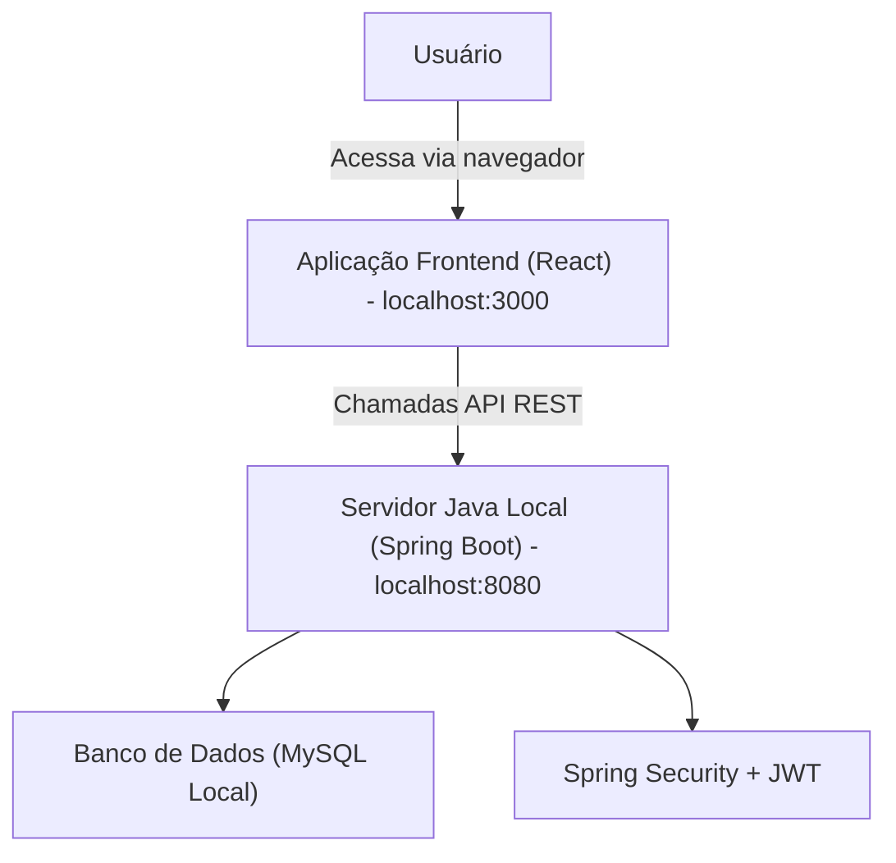

# 2. High-Level Architecture

### 2.1. Technical Summary

A arquitetura do TaskFlow será baseada em um **monólito modular (Spring Boot)** para o backend e uma **Single Page Application (SPA) com React** para o frontend. O foco principal é a implementação e apresentação da solução em um ambiente de desenvolvimento local. A integração entre frontend e backend ocorrerá via **APIs RESTful** bem definidas. O backend será executado em um servidor Java local (Spring Boot) e utilizará **MySQL local** como banco de dados. A autenticação será gerenciada internamente com **Spring Security e JWT**. Esta abordagem visa oferecer solidez e simplicidade para o desenvolvimento e demonstração do TaskFlow.

### 2.2. High-Level Architecture Diagram

### 2.3. Architectural Patterns

*   **Arquitetura Geral - Monólito Modular (Spring Boot):**
    *   **Descrição:** Uma aplicação backend única, mas estruturada internamente em módulos bem definidos e desacoplados, utilizando Spring Boot.
    *   **Justificativa:** Oferece simplicidade de desenvolvimento e implantação para o escopo atual do projeto, mantendo a capacidade de organizar o código de forma limpa e escalável internamente.

*   **Padrão de Frontend - UI Baseada em Componentes (React e TypeScript):**
    *   **Descrição:** Construção de interfaces de usuário a partir de componentes isolados, reutilizáveis e com estado próprio, usando React e TypeScript para tipagem forte.
    *   **Justificativa:** Facilita a manutenção, a reutilização de código e a testabilidade das interfaces, além de garantir maior robustez com o uso de tipos.

*   **Padrão de Backend - API RESTful:**
    *   **Descrição:** Comunicação entre frontend e backend através de uma interface de programação de aplicações (API) que segue os princípios REST (Representational State Transfer).
    *   **Justificativa:** Padroniza a comunicação, é amplamente suportada e compreendida, e facilita a integração entre diferentes partes do sistema.

