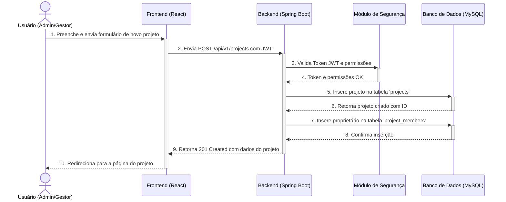

# 9. Fluxos de Trabalho Principais

### 9.1. Fluxo de Criação de Projeto

Este diagrama ilustra a criação de um novo projeto por um usuário autorizado.

```mermaid
sequenceDiagram
    actor User as Usuário (Admin/Gestor)
    participant Frontend as Frontend (React)
    participant Backend as Backend (Spring Boot)
    participant Security as Módulo de Segurança
    participant DB as Banco de Dados (MySQL)

    User->>+Frontend: 1. Preenche e envia formulário de novo projeto
    Frontend->>+Backend: 2. Envia POST /api/v1/projects com JWT
    Backend->>+Security: 3. Valida Token JWT e permissões
    Security-->>-Backend: 4. Token e permissões OK
    Backend->>+DB: 5. Insere projeto na tabela 'projects'
    DB-->>-Backend: 6. Retorna projeto criado com ID
    Backend->>+DB: 7. Insere proprietário na tabela 'project_members'
    DB-->>-Backend: 8. Confirma inserção
    Backend-->>-Frontend: 9. Retorna 201 Created com dados do projeto
    Frontend-->>-User: 10. Redireciona para a página do projeto
```

